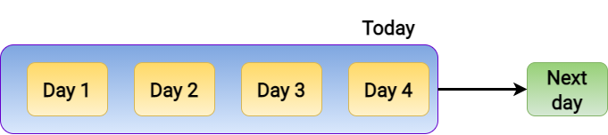
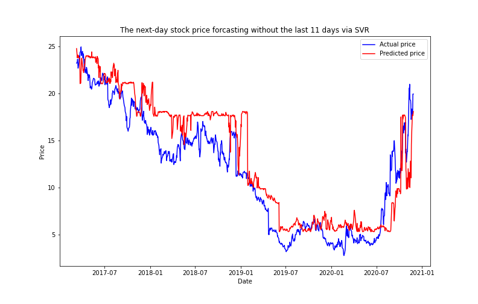
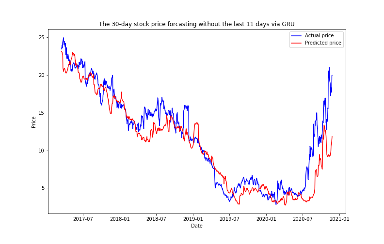

# Stock Price Forecasting

Course project for EECE 571T (Advanced Machine Learning Tools for Engineers) on University of British Colunmbia

## Authors
Menghong Huang & &nbsp; Zhaosheng Li

## Table of contents

- [Description](#Description)
- [ML models](#ML-models)
- [Data in this project](#Data-in-this-project)
- [Forecasts](#Forecasts)
- [Evaluation metrics](#Evaluation-metrics)
- [Files in this repo](#Files-in-this-repo)
- [Results](#Results)
- [Dependencies for this project](#Dependencies-for-this-project)
- [Download the code](#Download-the-code)

## Description
This project implements various machine learning (ML) models to forecast the stock price of an
American gaming merchandise retailer, namely, _GameStop Corporation (GME)_. There are two types of forecasts in this project, which are the next-day forecast and the 30-day forecast. 
The objective of this project is to compare the performance of each model on those two kinds of forecasts, and the comparison is based on several evaluation metrics.

## ML models

- Linear regression (LR)
- Support vector regression (SVR)
- Backpropagation neural network (BPNN)
- Simple recurrent neural network (RNN)
- Long short-term memory (LSTM) network
- Gated recurrent units (GRU) network

## Data in this project

The dataset in this project, _GME Historical Stock Prices_, is publicly available on [Kaggle](https://www.kaggle.com/hananxx/gamestop-historical-stock-prices). It is also generously offered by Yahoo finance website.
The dataset records the daily data of GME stock exchange, and each entry has six features related to the stock price. The six features are `open price`, `high price`, `low price`, `volume`, `close price`, and `adjusted close price` 

## Forecasts

### Next-day forecast

Most of the ML models in this project have the stock prices in the latest consecutive four days as input, whereas the LR and SVR models use the `close price` on today as input.
The GME close price right after today is the target variable.



&nbsp;

### 30-day forecast

Most of the ML models in this project have the stock prices in the latest thirty days in a row as input, whereas the LR and SVR models use the `close price` on today as input.
The GME close price on the 30th day after today is the target variable.


## Evaluation metrics

- Root mean square error (RMSE)
- Coefficient of determination (R<sup>2</sup>)
- Trend prediction accuracy (Accuracy)

## Files in this repo

This GitHub repo contains the following folders or files

+ `*_model` folders contain all the trained models used in this project

+ `data` folder contains the dataset used in this project

+ `doc` folder contains the documentation that is relevant to this work, which include a project report that has specific technical details and in-depth discussion

+ `img` folder mainly contains the images of the training results, model structures, and test results

+ `BPNN_1.ipynb` is the code for using BPNN to do next-day forecast

+ `BPNN_30.ipynb` is the code for using BPNN to do 30-day forecast

+ `GRU_1.ipynb` is the code for using GRU to do next-day forecast

+ `GRU_30.ipynb` is the code for using GRU to do 30-day forecast

+ `LSTM_1.ipynb` is the code for using LSTM to do next-day forecast

+ `LSTM_30.ipynb` is the code for using LSTM to do 30-day forecast

+ `SVR2.0_1.ipynb` is the code for using SVR and LR models to do next-day forecast

+ `SVR2.0_30.ipynb` is the code for using SVR and LR models to do 30-day forecast

+ `simpleRNN_1.ipynb` is the code for using simple RNN to do next-day forecast

+ `simpleRNN_30.ipynb` is the code for using simple RNN to do 30-day forecast

+ `SVR.ipynb` is out initial attempt on this project, which aims to conduct day-to-day forecast. But the result is far below our expectation and turns our prediction into the next-day forecast and 30-day forecast instead

## Results

### Next-day forecasting result

| | LR | SVR | BPNN | Simple RNN | LSTM | GRU |
| -------- | -------- | -------- | -------- | -------- | -------- | -------- |
| RMSE | 0.502 | 0.528 | 0.557 | 0.669 | 0.583 | 0.663 |
| R<sup>2</sup> | 0.993 | 0.993 | 0.992 | 0.988 | 0.991 | 0.988 |
| Accuracy | 50.1% | 48.6% | 47.6% | 50.9% | 49.6% | 49.8% |

| LR                   | SVR        |
| -------------------------- | ------------------------- |
|  |  |

| BPNN                   | Simple RNN       |
| -------------------------- | ------------------------- |
|  |  |

| LSTM                   | GRU       |
| -------------------------- | ------------------------- |
|  |  |

&nbsp;

### 30-day forecasting result

| | LR | SVR | BPNN | Simple RNN | LSTM | GRU |
| -------- | -------- | -------- | -------- | -------- | -------- | -------- |
| RMSE | 2.365 | 2.809 | 3.539 | 3.509 | 2.407 | 2.438 |
| R<sup>2</sup> | 0.848 | 0.786 | 0.654 | 0.660 | 0.841 | 0.836 |
| Accuracy | 51.3% | 48.3% | 51.1% | 49.1% | 48.9% | 50.3% |

| LR                   | SVR        |
| -------------------------- | ------------------------- |
|  |  |

| BPNN                   | Simple RNN       |
| -------------------------- | ------------------------- |
|  |  |

| LSTM                   | GRU       |
| -------------------------- | ------------------------- |
|  |  |

## Dependencies for this project

This project requires the following python modules:

```python
numpy  matplotlib.pyplot  pandas  sklearn  keras  seaborn  joblib
```

Please make sure you have all the modules installed before running the code. For installing these modules, one can use command `pip install` or `conda install`

## Download the code

```bash
git clone https://github.com/zhaoshengEE/Stock_Price_Forecasting.git
```